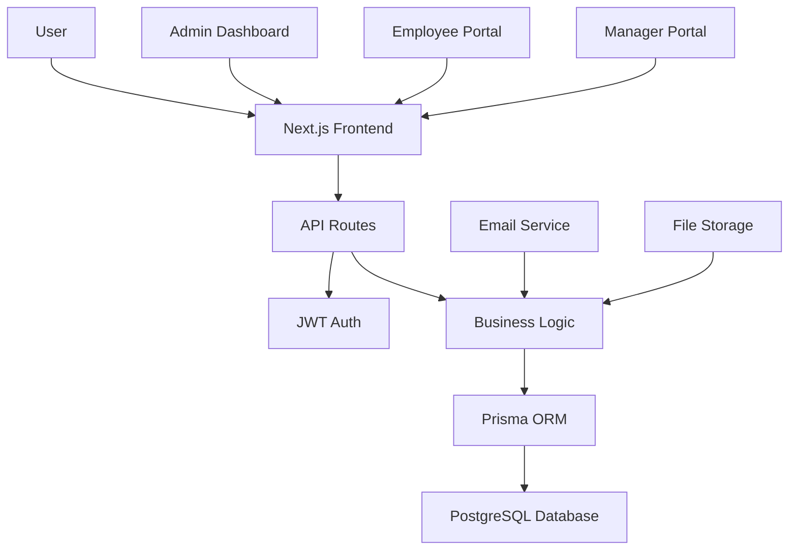

# HRMS System Design

## Overview
This document outlines the system design for an enterprise-level Human Resource Management System (HRMS) built with Next.js. The system aims to increase efficiency, reduce manual HR tasks, and improve data management through comprehensive HR modules.

## Features
- **Employee Management**: CRUD operations for employee data, organizational structure
- **Attendance Tracking**: Clock in/out, attendance records, overtime tracking
- **Leave Management**: Leave requests, approvals, balance tracking
- **Payroll Processing**: Salary calculations, deductions, payslip generation
- **Recruitment Management**: Job postings, applicant tracking, interview scheduling
- **Performance Evaluation**: Performance reviews, goal setting, feedback
- **Reporting and Analytics**: HR metrics, dashboards, custom reports

## Technology Stack
- **Frontend**: Next.js 14+ with TypeScript, React
- **Backend**: Next.js API Routes
- **Database**: PostgreSQL (for enterprise scalability and complex relationships)
- **Authentication**: JWT (JSON Web Tokens)
- **Styling**: Tailwind CSS
- **State Management**: Zustand or Redux Toolkit
- **ORM**: Prisma (for type-safe database operations)

## System Architecture



## Database Schema

### Core Tables
- **users**: Authentication and basic user info
- **employees**: Extended employee information
- **departments**: Organizational structure
- **positions**: Job roles and titles
- **attendance**: Time tracking records
- **leaves**: Leave requests and approvals
- **payroll**: Salary and compensation data
- **recruitments**: Job postings and applications
- **performance_reviews**: Employee evaluations

### Key Relationships
- Employee belongs to Department and Position
- Attendance linked to Employee
- Leaves associated with Employee and approver
- Payroll calculated per Employee
- Performance reviews for Employees

## API Design

### Authentication Endpoints
- `POST /api/auth/login` - User login
- `POST /api/auth/register` - User registration
- `POST /api/auth/refresh` - Token refresh
- `POST /api/auth/logout` - User logout

### Employee Management
- `GET /api/employees` - List employees (with pagination/filtering)
- `POST /api/employees` - Create employee
- `GET /api/employees/:id` - Get employee details
- `PUT /api/employees/:id` - Update employee
- `DELETE /api/employees/:id` - Delete employee

### Attendance
- `POST /api/attendance/clock-in` - Clock in
- `POST /api/attendance/clock-out` - Clock out
- `GET /api/attendance/:employeeId` - Get attendance records

### Leave Management
- `POST /api/leaves` - Request leave
- `GET /api/leaves` - List leave requests
- `PUT /api/leaves/:id/approve` - Approve leave
- `PUT /api/leaves/:id/reject` - Reject leave

### Payroll
- `GET /api/payroll/:employeeId` - Get payroll history
- `POST /api/payroll/process` - Process payroll (admin only)

### Recruitment
- `POST /api/jobs` - Create job posting
- `GET /api/jobs` - List job postings
- `POST /api/applications` - Submit application
- `GET /api/applications` - List applications

### Performance
- `POST /api/performance/reviews` - Create performance review
- `GET /api/performance/reviews/:employeeId` - Get reviews

### Reports
- `GET /api/reports/attendance` - Attendance reports
- `GET /api/reports/payroll` - Payroll reports
- `GET /api/reports/employees` - Employee statistics

## Frontend Structure

```
src/
├── app/
│   ├── (auth)/
│   │   ├── login/
│   │   └── register/
│   ├── dashboard/
│   │   ├── employees/
│   │   ├── attendance/
│   │   ├── leaves/
│   │   ├── payroll/
│   │   ├── recruitment/
│   │   ├── performance/
│   │   └── reports/
│   ├── api/
│   └── layout.tsx
├── components/
│   ├── ui/ (shadcn/ui components)
│   ├── forms/
│   ├── tables/
│   └── charts/
├── lib/
│   ├── auth.ts
│   ├── db.ts (Prisma client)
│   └── utils.ts
└── types/
    └── index.ts
```

## Security Considerations
- JWT tokens with expiration
- Role-based access control (Admin, Manager, Employee)
- Input validation and sanitization
- SQL injection prevention via ORM
- HTTPS encryption
- Password hashing with bcrypt

## Performance Optimization
- Database indexing on frequently queried fields
- API response caching
- Image/file optimization
- Lazy loading for large lists
- Pagination for data-heavy endpoints

## Deployment
- Vercel for frontend hosting
- Railway/PlanetScale for database
- CI/CD with GitHub Actions
- Environment-based configuration

## Next Steps
1. Set up Prisma schema
2. Implement authentication
3. Create core employee management
4. Build attendance tracking
5. Add leave management
6. Implement payroll system
7. Develop recruitment module
8. Create performance evaluation
9. Build reporting dashboard
10. Testing and deployment